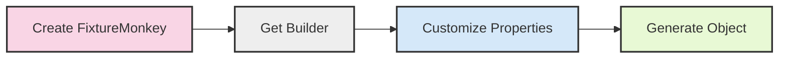

import Tabs from '@theme/Tabs';
import TabItem from '@theme/TabItem';


## What You'll Learn
- Core methods for customizing test objects with Fixture Monkey
- Basic approaches to customize simple and complex objects
- Solutions to the most common problems beginners face

## 5-Minute Quick Start

> This section covers only the essential information needed to get started with Fixture Monkey.

### 4 Key Methods You Must Know

If you're short on time, here's what you need to know right now:


<Tabs groupId="language">
<TabItem value="java" label="Java">

```java
// 1. Create FixtureMonkey instance
FixtureMonkey fixtureMonkey = FixtureMonkey.create();

// 2. Create a product with specific property values
Product product = fixtureMonkey.giveMeBuilder(Product.class)
    .set("name", "Smartphone")         // Set property
    .set("price", new BigDecimal(499)) // Set another property
    .sample();                         // Create the actual object

// 3. Create an order with a list of products
Order order = fixtureMonkey.giveMeBuilder(Order.class)
    .size("products", 2)               // Set list size to 2
    .set("products[0].name", "Laptop") // Customize list element
    .sample();
```

</TabItem>
<TabItem value="kotlin" label="Kotlin">

```kotlin
// 1. Create FixtureMonkey instance
val fixtureMonkey = FixtureMonkey.create()

// 2. Create a product with specific property values
val product = fixtureMonkey.giveMeBuilder<Product>()
    .setExp(Product::name, "Smartphone")        // Set property
    .setExp(Product::price, BigDecimal(499))    // Set another property
    .sample()                                   // Create the actual object

// 3. Create an order with a list of products
val order = fixtureMonkey.giveMeBuilder<Order>()
    .sizeExp(Order::products, 2)                // Set list size to 2
    .set("products[0].name", "Laptop")          // Customize list element
    .sample()
```

</TabItem>
</Tabs>


### Visual Overview

Here's a simple flowchart showing the process of customizing objects with Fixture Monkey:



## Prerequisites
This guide assumes:
- You've already added Fixture Monkey to your project
- You know how to create a basic FixtureMonkey instance

If you haven't set up Fixture Monkey yet, refer to the [Getting Started](../get-started/requirements) section first.

## Basic Customization Methods

> This section introduces the most fundamental customization methods you'll use daily.

### Setting Property Values

The most basic way to customize an object is to set specific property values:


<Tabs groupId="language">
<TabItem value="java" label="Java">

```java
Product product = fixtureMonkey.giveMeBuilder(Product.class)
    .set("name", "Smartphone")
    .set("price", new BigDecimal("499.99"))
    .set("available", true)
    .sample();
```

</TabItem>
<TabItem value="kotlin" label="Kotlin">

```kotlin
val product = fixtureMonkey.giveMeBuilder<Product>()
    .setExp(Product::name, "Smartphone")
    .setExp(Product::price, BigDecimal("499.99"))
    .setExp(Product::available, true)
    .sample()
```

</TabItem>
</Tabs>


### Setting Null Values

When you need to test with null values:


<Tabs groupId="language">
<TabItem value="java" label="Java">

```java
Product nullNameProduct = fixtureMonkey.giveMeBuilder(Product.class)
    .setNull("name")  // Set name to null
    .sample();
```

</TabItem>
<TabItem value="kotlin" label="Kotlin">

```kotlin
val nullNameProduct = fixtureMonkey.giveMeBuilder<Product>()
    .setNullExp(Product::name)  // Set name to null
    .sample()
```

</TabItem>
</Tabs>


## Working with Collections

The most important thing when working with collections is to set the size first:


<Tabs groupId="language">
<TabItem value="java" label="Java">

```java
// Create an order with 2 products
Order orderWith2Products = fixtureMonkey.giveMeBuilder(Order.class)
    .size("products", 2)               // Set size first
    .set("products[0].name", "Laptop") // Then customize elements
    .sample();
```

</TabItem>
<TabItem value="kotlin" label="Kotlin">

```kotlin
// Create an order with 2 products
val orderWith2Products = fixtureMonkey.giveMeBuilder<Order>()
    .sizeExp(Order::products, 2)       // Set size first
    .set("products[0].name", "Laptop") // Then customize elements
    .sample()
```

</TabItem>
</Tabs>


For more advanced collection customization, check the [Path Expressions](../customizing-objects/path-expressions) document.

## Customizing Nested Objects

You can access nested properties using dot notation:


<Tabs groupId="language">
<TabItem value="java" label="Java">

```java
// Create a customer with an address
Customer customer = fixtureMonkey.giveMeBuilder(Customer.class)
    .set("name", "John Doe")
    .set("address.street", "123 Main Street")  // Nested property
    .set("address.city", "New York")           // Nested property
    .sample();
```

</TabItem>
<TabItem value="kotlin" label="Kotlin">

```kotlin
// Create a customer with an address
val customer = fixtureMonkey.giveMeBuilder<Customer>()
    .setExp(Customer::name, "John Doe")
    .set("address.street", "123 Main Street")  // Nested property
    .set("address.city", "New York")           // Nested property
    .sample()
```

</TabItem>
</Tabs>


For more complex nested object customization, check the [InnerSpec](../customizing-objects/innerspec) guide.

## Frequently Asked Questions

> The most common issues beginners face.

### Why is my collection empty when I tried to customize an element?

The most common mistake is not setting the collection size first:


<Tabs groupId="language">
<TabItem value="java" label="Java">

```java
// Wrong way - collection might be empty
Order orderWrong = fixtureMonkey.giveMeBuilder(Order.class)
    .set("products[0].name", "Laptop")  // This might not work!
    .sample();

// Correct way - set size first
Order orderCorrect = fixtureMonkey.giveMeBuilder(Order.class)
    .size("products", 1)                // Set size first!
    .set("products[0].name", "Laptop")  // Now this works
    .sample();
```

</TabItem>
<TabItem value="kotlin" label="Kotlin">

```kotlin
// Wrong way - collection might be empty
val orderWrong = fixtureMonkey.giveMeBuilder<Order>()
    .set("products[0].name", "Laptop")  // This might not work!
    .sample()

// Correct way - set size first
val orderCorrect = fixtureMonkey.giveMeBuilder<Order>()
    .sizeExp(Order::products, 1)        // Set size first!
    .set("products[0].name", "Laptop")  // Now this works
    .sample()
```

</TabItem>
</Tabs>


### Why do I get null values when I didn't set them to null?

By default, Fixture Monkey may generate null values for some properties. To ensure values are not null:


<Tabs groupId="language">
<TabItem value="java" label="Java">

```java
Product nonNullProduct = fixtureMonkey.giveMeBuilder(Product.class)
    .setNotNull("name")        // Ensure name is not null
    .setNotNull("price")       // Ensure price is not null
    .sample();
```

</TabItem>
<TabItem value="kotlin" label="Kotlin">

```kotlin
val nonNullProduct = fixtureMonkey.giveMeBuilder<Product>()
    .setNotNullExp(Product::name)    // Ensure name is not null
    .setNotNullExp(Product::price)   // Ensure price is not null
    .sample()
```

</TabItem>
</Tabs>


## Next Steps

Now that you've learned the basics, explore these topics for more advanced usage:

1. **[Path Expressions](../customizing-objects/path-expressions)** - Accessing and customizing nested properties
2. **[Customization APIs](../customizing-objects/apis)** - Complete list of customization methods
3. **[Testing Interfaces](../customizing-objects/interface)** - How to work with interfaces
4. **[InnerSpec](../customizing-objects/innerspec)** - Advanced customization for complex objects
5. **[Arbitrary](../customizing-objects/arbitrary)** - Generating test data with specific constraints

