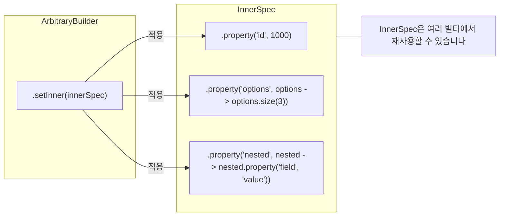

import Tabs from '@theme/Tabs';
import TabItem from '@theme/TabItem';


## 이 문서에서 배우는 내용
- 복잡한 객체 구조를 더 세밀하게 커스터마이징하는 방법
- 맵(Map) 타입의 속성을 효과적으로 다루는 방법
- 재사용 가능한 커스터마이징 명세를 작성하는 방법

## InnerSpec 소개

> *이 섹션에서는 InnerSpec의 기본 개념과 복잡한 객체를 커스터마이징할 때 왜 유용한지 배우게 됩니다.*

이전 문서들에서 기본적인 속성 변경 방법을 배웠다면, 이제 **더 복잡한 객체 구조**를 다루는 방법을 배워보겠습니다. 

### InnerSpec이란 무엇이고 왜 사용하나요?

**InnerSpec**은 픽스처 몽키에서 복잡한 중첩 객체를 구조화된 방식으로 커스터마이징하는데 도움을 주는 강력한 도구입니다. 객체를 어떻게 커스터마이징하고 싶은지에 대한 "명세서"라고 생각하면 됩니다.

다음과 같은 경우에 InnerSpec을 사용하면 좋습니다:
- 깊게 중첩된 객체를 커스터마이징해야 할 때
- Map 타입 속성으로 작업할 때 (일반 표현식으로는 쉽게 커스터마이징할 수 없음)
- 여러 테스트에서 재사용 가능한 커스터마이징 패턴을 만들고 싶을 때
- 복잡한 객체 구조에 대해 더 많은 제어가 필요할 때

InnerSpec은 적용하려는 커스터마이징에 대한 타입 독립적인 명세입니다.
ArbitraryBuilder 내의 `setInner()` 메서드를 사용하면 `InnerSpec` 인스턴스에 정의된 명세를 빌더에 적용할 수 있습니다.

### 간단한 예제

InnerSpec이 어떻게 작동하는지 이해하기 위해 매우 간단한 예제로 시작해 보겠습니다. Product 클래스가 있다고 가정해 봅시다:

```java
public class Product {
    private Long id;
    private String name;
    private BigDecimal price;
    // getter와 setter
}
```

다음은 InnerSpec을 사용하여 이를 커스터마이징하는 방법입니다:

```java
// Fixture Monkey 인스턴스 생성
FixtureMonkey fixtureMonkey = FixtureMonkey.create();

// 제품 속성을 커스터마이징하는 InnerSpec 생성
InnerSpec productSpec = new InnerSpec()
    .property("id", 1000L)
    .property("name", "스마트폰")
    .property("price", new BigDecimal("499.99"));

// InnerSpec을 Product 빌더에 적용
Product product = fixtureMonkey.giveMeBuilder(Product.class)
    .setInner(productSpec)
    .sample();

// 이제 product는 id=1000, name="스마트폰", price=499.99를 가집니다
```

## InnerSpec의 시각적 표현

InnerSpec을 사용하면 더 구조화된 방식으로 커스터마이징을 정의할 수 있습니다. 다음은 시각적 표현입니다:



### InnerSpec과 일반 표현식 비교

중첩된 구조를 커스터마이징하는 방법을 비교해 보겠습니다:

#### 경로 표현식 사용:
```java
builder.set("merchantInfo.id", 1001)
       .set("merchantInfo.name", "ABC 상점")
       .set("merchantInfo.address.city", "서울")
```

#### InnerSpec 사용 (더 구조화된 방식):
```java
InnerSpec merchantSpec = new InnerSpec()
    .property("id", 1001)
    .property("name", "ABC 상점")
    .property("address", address -> address.property("city", "서울"));

builder.setInner(
    new InnerSpec().property("merchantInfo", merchantInfo -> merchantInfo.inner(merchantSpec))
);
```

**InnerSpec을 선택해야 하는 경우:**
- Map 속성을 커스터마이징해야 할 때 (일반 표현식으로는 불가능)
- 동일한 커스터마이징 패턴을 여러 테스트에서 재사용하고 싶을 때
- 복잡한 중첩 객체 구조가 있어 중첩된 InnerSpec으로 표현하는 것이 더 명확할 때
- 더 구조화되고 타입 독립적인 커스터마이징이 필요할 때

**일반 표현식을 선택해야 하는 경우:**
- 간단한 속성 접근 및 커스터마이징
- 덜 깊게 중첩된 구조
- 간단한 커스터마이징에 대해 더 간결한 코드를 원할 때

InnerSpec의 추가적인 장점은 일반 표현식과 달리 맵 속성을 커스터마이징할 수 있다는 점입니다.

:::tip
Kotlin EXP 는 InnerSpec에서 지원하지 않습니다. InnerSpec은 타입 독립적으로 설계되었기 때문에, 프로퍼티 이름을 통해 프로퍼티를 접근해야 합니다.
:::

## 단계별 튜토리얼: 복잡한 객체 커스터마이징하기

InnerSpec을 사용하여 복잡한 객체 구조를 커스터마이징하는 방법을 완전한 예제를 통해 살펴보겠습니다.

### 1단계: 클래스 정의하기

먼저 전형적인 전자상거래 도메인 모델을 나타내는 몇 가지 클래스를 정의해 보겠습니다:

```java
// 간단한 주소 클래스
public class Address {
    private String street;
    private String city;
    private String country;
    private String zipCode;
    // getter와 setter
}

// 위치 및 연락처 정보가 있는 상점
public class Store {
    private Long id;
    private String name;
    private Address address;
    private Map<String, String> contactInfo; // 예: "phone" -> "123-456-7890"
    // getter와 setter
}

// 상점이 판매하는 제품
public class Product {
    private Long id;
    private String name;
    private BigDecimal price;
    private List<String> categories;
    private Store store;
    // getter와 setter
}
```

### 2단계: 주소를 위한 InnerSpec 만들기

주소에 대한 InnerSpec을 만드는 것부터 시작하겠습니다:

```java
InnerSpec addressSpec = new InnerSpec()
    .property("street", "123 Main St")
    .property("city", "뉴욕")
    .property("country", "미국")
    .property("zipCode", "10001");
```

### 3단계: 연락처 정보 맵이 있는 상점을 위한 InnerSpec 만들기

이제 주소 명세를 포함하고 contactInfo 맵을 설정하여 상점에 대한 InnerSpec을 만들어 보겠습니다:

```java
InnerSpec storeSpec = new InnerSpec()
    .property("id", 500L)
    .property("name", "전자제품 상점")
    .property("address", address -> address.inner(addressSpec))
    .property("contactInfo", contactInfo -> contactInfo
        .size(2) // 맵 크기를 2개 항목으로 설정
        .entry("phone", "123-456-7890")
        .entry("email", "contact@electronics.com"));
```

### 4단계: 카테고리 목록이 있는 제품을 위한 InnerSpec 만들기

마지막으로, 상점 명세를 포함하고 카테고리 목록을 설정하여 제품에 대한 InnerSpec을 만들어 보겠습니다:

```java
InnerSpec productSpec = new InnerSpec()
    .property("id", 1000L)
    .property("name", "울트라 HD TV")
    .property("price", new BigDecimal("1299.99"))
    .property("categories", categories -> categories
        .size(3) // 목록 크기를 3으로 설정
        .listElement(0, "전자제품")
        .listElement(1, "TV")
        .listElement(2, "울트라 HD"))
    .property("store", store -> store.inner(storeSpec));
```

### 5단계: InnerSpec을 적용하여 제품 생성하기

이제 InnerSpec을 사용하여 제품 인스턴스를 만들어 보겠습니다:

```java
// Fixture Monkey 인스턴스 생성
FixtureMonkey fixtureMonkey = FixtureMonkey.create();

// InnerSpec을 적용하여 제품 생성
Product product = fixtureMonkey.giveMeBuilder(Product.class)
    .setInner(productSpec)
    .sample();

// 이제 모든 중첩 객체가 포함된 완전히 커스터마이징된 제품이 있습니다
```

### 6단계: 결과 확인하기

모든 속성이 올바르게 설정되었는지 확인할 수 있습니다:

```java
// 제품 속성 확인
assertEquals(1000L, product.getId());
assertEquals("울트라 HD TV", product.getName());
assertEquals(new BigDecimal("1299.99"), product.getPrice());

// 카테고리 목록 확인
List<String> expectedCategories = List.of("전자제품", "TV", "울트라 HD");
assertEquals(expectedCategories, product.getCategories());

// 상점 속성 확인
Store store = product.getStore();
assertEquals(500L, store.getId());
assertEquals("전자제품 상점", store.getName());

// 주소 속성 확인
Address address = store.getAddress();
assertEquals("123 Main St", address.getStreet());
assertEquals("뉴욕", address.getCity());
assertEquals("미국", address.getCountry());
assertEquals("10001", address.getZipCode());

// 연락처 정보 맵 확인
Map<String, String> contactInfo = store.getContactInfo();
assertEquals(2, contactInfo.size());
assertEquals("123-456-7890", contactInfo.get("phone"));
assertEquals("contact@electronics.com", contactInfo.get("email"));
```

## ArbitraryBuilder 에 InnerSpec 적용하기

빌더에 미리 정의된 `InnerSpec` 을 적용하려면 다음과 같이 `setInner()` 메서드를 사용하세요.


<Tabs groupId="language">
<TabItem value="java" label="Java">

```java
InnerSpec innerSpec = new InnerSpec().property("id", 1000);

fixtureMonkey.giveMeBuilder(Product.class)
    .setInner(innerSpec);
```

</TabItem>
<TabItem value="kotlin" label="Kotlin">

```kotlin
val innerSpec = InnerSpec().property("id", 1000)

fixtureMonkey.giveMeBuilder<Product>()
    .setInner(innerSpec)
```

</TabItem>
</Tabs>


## 프로퍼티 커스터마이징하기

### property()

ArbitraryBuilder 의 `set()` 메서드와 유사하게, 프로퍼티 이름과 원하는 값을 지정하여 프로퍼티를 커스터마이징할 수 있습니다.

:::danger
요소(`[]`) 또는 중첩 필드(`.`)를 참조하는 Fixture Monkey 표현식은 프로퍼티 이름으로 사용할 수 없습니다. 프로퍼티 이름 자체만 사용할 수 있습니다.
:::


<Tabs groupId="language">
<TabItem value="java" label="Java">

```java
InnerSpec innerSpec = new InnerSpec()
    .property("id", 1000);
```

</TabItem>
<TabItem value="kotlin" label="Kotlin">

```kotlin
val innerSpec = InnerSpec()
    .property("id", 1000)
```

</TabItem>
</Tabs>


### size(), minSize(), maxSize()

`size()`, `minSize()`, 그리고 `maxSize()` 는 프로퍼티의 크기를 지정하는 데 사용할 수 있습니다.

앞서 언급했듯이, InnerSpec 은 중첩된 방식으로 명세을 정의합니다.
`property()` 를 사용하여 컨테이너 프로퍼티를 먼저 선택한 다음, 내부에 정의된 `innerSpec` 컨슈머를 사용하여 크기를 설정할 수 있습니다.


<Tabs groupId="language">
<TabItem value="java" label="Java">

```java
InnerSpec innerSpec = new InnerSpec()
    .property("options", options -> options.size(5)); // size:5

InnerSpec innerSpec = new InnerSpec()
    .property("options", options -> options.size(3, 5)); // minSize:3, maxSize:5

InnerSpec innerSpec = new InnerSpec()
    .property("options", options -> options.minSize(3)); // minSize:3

InnerSpec innerSpec = new InnerSpec()
    .property("options", options -> options.maxSize(5)); // maxSize:5
```

</TabItem>
<TabItem value="kotlin" label="Kotlin">

```kotlin
val innerSpec = InnerSpec()
    .property("options") { it.size(5) } // size:5

val innerSpec = InnerSpec()
    .property("options") { it.size(3, 5) } // minSize:3, maxSize:5

val innerSpec = InnerSpec()
    .property("options") { it.minSize(3) } // minSize:3

val innerSpec = InnerSpec()
    .property("options") { it.maxSize(5) } // maxSize:5
```

</TabItem>
</Tabs>


### postCondition()

`postCondition()` 은 프로퍼티가 특정 조건을 만족해야 하는 경우 사용할 수 있습니다.

:::danger
setPostCondition 의 조건을 너무 좁게 설정하면, 생성 비용이 매우 높아질 수 있습니다. 이런 경우 set 을 사용해주세요.
:::


<Tabs groupId="language">
<TabItem value="java" label="Java">

```java
InnerSpec innerSpec = new InnerSpec()
    .property("id", id -> id.postCondition(Long.class, it -> it > 0));
```

</TabItem>
<TabItem value="kotlin" label="Kotlin">

```kotlin
val innerSpec = InnerSpec()
    .property("id") { it.postCondition(Long::class.java) { it > 0 }}
```

</TabItem>
</Tabs>


### inner()

또한 `inner()` 를 사용하여 미리 정의된 InnerSpec 을 사용하여 프로퍼티를 커스터마이징할 수 있습니다.


<Tabs groupId="language">
<TabItem value="java" label="Java">

```java
InnerSpec innerSpec = new InnerSpec()
    .property("id", 1000L);

fixtureMonkey.giveMeBuilder(Product.class)
    .setInner(
        new InnerSpec()
            .property("nestedObject", nestedObject -> nestedObject.inner(innerSpec))
    );
```

</TabItem>
<TabItem value="kotlin" label="Kotlin">

```kotlin
val innerSpec = InnerSpec()
    .property("id", 1000L)

fixtureMonkey.giveMeBuilder<Product>()
    .setInner(
        InnerSpec()
            .property("nestedObject") { it.inner(innerSpec) }
    )
```

</TabItem>
</Tabs>


## 리스트 커스터마이징하기

### listElement()

리스트 내의 개별 요소는 `listElement()`를 사용하여 선택할 수 있습니다.
이는 픽스처 몽키 표현식을 사용하여 "[n]"으로 요소를 참조하는 것과 동일합니다.


<Tabs groupId="language">
<TabItem value="java" label="Java">

```java
InnerSpec innerSpec = new InnerSpec()
    .property("options", options -> options.listElement(0, "red"));

// 리스트 크기를 먼저 설정하는 것이 좋습니다 - 아래와 같이 하는 것이 더 안전합니다
InnerSpec innerSpec = new InnerSpec()
    .property("options", options -> options
        .size(3)  // 리스트 크기를 3으로 설정
        .listElement(0, "red")
        .listElement(1, "green")
        .listElement(2, "blue")
    );
```

</TabItem>
<TabItem value="kotlin" label="Kotlin">

```kotlin
val innerSpec = InnerSpec()
    .property("options") { it.listElement(0, "red") }

// 리스트 크기를 먼저 설정하는 것이 좋습니다
val innerSpec = InnerSpec()
    .property("options") { it
        .size(3)  // 리스트 크기를 3으로 설정
        .listElement(0, "red")
        .listElement(1, "green")
        .listElement(2, "blue")
    }
```

</TabItem>
</Tabs>


### allListElement()

만약 리스트의 모든 요소를 동시에 같은 값으로 설정하려면 `allListElement()`를 사용할 수 있습니다.
이는 픽스처 몽키 표현식을 사용하여 "[*]"로 요소를 참조하는 것과 동일합니다.


<Tabs groupId="language">
<TabItem value="java" label="Java">

```java
// 리스트 크기를 먼저 설정한 다음 모든 요소를 "red"로 설정
InnerSpec innerSpec = new InnerSpec()
    .property("options", options -> options
        .size(5)  // 크기가 5인 리스트 생성
        .allListElement("red")  // 모든 요소를 "red"로 설정
    );
```

</TabItem>
<TabItem value="kotlin" label="Kotlin">

```kotlin
// 리스트 크기를 먼저 설정한 다음 모든 요소를 "red"로 설정
val innerSpec = InnerSpec()
    .property("options") { it
        .size(5)  // 크기가 5인 리스트 생성
        .allListElement("red")  // 모든 요소를 "red"로 설정
    }
```

</TabItem>
</Tabs>


## 맵 커스터마이징하기

InnerSpec은 맵 프로퍼티 엔트리를 커스터마이징하기 위해 특별한 메서드를 제공합니다. Map 타입의 속성을 다룰 때는 일반 표현식보다 InnerSpec을 사용하는 것이 훨씬 더 강력하고 유연합니다.

:::danger
중요: 맵 프로퍼티의 크기를 먼저 지정하지 않고 맵 엔트리를 설정하면 변경이 일어나지 않을 수 있습니다. 항상 값을 설정하기 전에 size() 메서드로 맵 크기를 먼저 설정하세요.
:::

### key(), value(), entry()

`key()`, `value()`, `entry()` 메서드를 사용하여 맵 프로퍼티 엔트리를 커스터마이징할 수 있습니다.
- `key()`를 사용하면 맵 엔트리의 키에 지정된 값을 할당하고, 엔트리의 값은 무작위로 설정됩니다.
- `value()`를 사용하면 맵 엔트리의 값에 지정된 값을 할당하고, 키는 무작위로 설정됩니다.
- 키와 값을 동시에 지정하려면 `entry()`를 사용하는 것이 가장 직관적입니다.


<Tabs groupId="language">
<TabItem value="java" label="Java">

```java
// 맵 크기 지정 없이 - 주의: 이 방식은 작동하지 않을 수 있습니다!
InnerSpec innerSpec = new InnerSpec()
    .property("merchantInfo", merchantInfo -> merchantInfo.key(1000));

// 올바른 방법: 맵 크기를 먼저 지정
InnerSpec innerSpec = new InnerSpec()
    .property("merchantInfo", merchantInfo -> merchantInfo
        .size(1)  // 맵 크기 지정
        .key(1000)  // 키만 지정
    );

// 값만 지정하기
InnerSpec innerSpec = new InnerSpec()
    .property("merchantInfo", merchantInfo -> merchantInfo
        .size(1)
        .value("ABC 상점")
    );

// 키와 값 모두 지정하기 (권장)
InnerSpec innerSpec = new InnerSpec()
    .property("merchantInfo", merchantInfo -> merchantInfo
        .size(1)
        .entry(1000, "ABC 상점")
    );
```

</TabItem>
<TabItem value="kotlin" label="Kotlin">

```kotlin
// 맵 크기 지정 없이 - 주의: 이 방식은 작동하지 않을 수 있습니다!
val innerSpec = InnerSpec()
    .property("merchantInfo") { it.key(1000) }

// 올바른 방법: 맵 크기를 먼저 지정
val innerSpec = InnerSpec()
    .property("merchantInfo") { it
        .size(1)  // 맵 크기 지정
        .key(1000)  // 키만 지정
    }

// 값만 지정하기
val innerSpec = InnerSpec()
    .property("merchantInfo") { it
        .size(1)
        .value("ABC 상점")
    }

// 키와 값 모두 지정하기 (권장)
val innerSpec = InnerSpec()
    .property("merchantInfo") { it
        .size(1)
        .entry(1000, "ABC 상점")
    }
```

</TabItem>
</Tabs>


### keys(), values(), entries()

맵 내의 여러 개의 엔트리를 한 번에 설정할 때 `keys()`, `values()`, `entries()`를 사용하여 여러 값을 전달할 수 있습니다.


<Tabs groupId="language">
<TabItem value="java" label="Java">

```java
// 여러 키 설정하기
InnerSpec innerSpec = new InnerSpec()
    .property("merchantInfo", merchantInfo -> merchantInfo
        .size(3)  // 중요: 크기를 먼저 설정
        .keys(1000, 1001, 1002)  // 3개의 키 설정
    );

// 여러 값 설정하기
InnerSpec innerSpec = new InnerSpec()
    .property("merchantInfo", merchantInfo -> merchantInfo
        .size(3)
        .values("ABC 상점", "123 편의점", "XYZ 마트")
    );

// 여러 키-값 쌍 설정하기
InnerSpec innerSpec = new InnerSpec()
    .property("merchantInfo", merchantInfo -> merchantInfo
        .size(3)
        .entries(1000, "ABC 상점", 1001, "123 편의점", 1002, "XYZ 마트")
    );
```

</TabItem>
<TabItem value="kotlin" label="Kotlin">

```kotlin
// 여러 키 설정하기
val innerSpec = InnerSpec()
    .property("merchantInfo") { it
        .size(3)  // 중요: 크기를 먼저 설정
        .keys(1000, 1001, 1002)  // 3개의 키 설정
    }

// 여러 값 설정하기
val innerSpec = InnerSpec()
    .property("merchantInfo") { it
        .size(3)
        .values("ABC 상점", "123 편의점", "XYZ 마트")
    }

// 여러 키-값 쌍 설정하기
val innerSpec = InnerSpec()
    .property("merchantInfo") { it
        .size(3)
        .entries(1000, "ABC 상점", 1001, "123 편의점", 1002, "XYZ 마트")
    }
```

</TabItem>
</Tabs>


### allKey(), allValue(), allEntry()

`allListElement()`와 유사하게, `allKey()`, `allValue()`, `allEntry()`를 사용하여 맵 내의 모든 엔트리를 동일한 지정된 값으로 설정할 수 있습니다.


<Tabs groupId="language">
<TabItem value="java" label="Java">

```java
// 모든 엔트리에 동일한 키 설정
InnerSpec innerSpec = new InnerSpec()
    .property("merchantInfo", merchantInfo -> merchantInfo
        .size(3)  // 3개의 엔트리 생성
        .allKey(1000)  // 모든 키를 1000으로 설정 (주의: 같은 키를 여러번 가질 수 없으므로 실제로는 문제 발생)
    );

// 모든 엔트리에 동일한 값 설정
InnerSpec innerSpec = new InnerSpec()
    .property("merchantInfo", merchantInfo -> merchantInfo
        .size(3)  // 3개의 엔트리 생성
        .allValue("ABC 상점")  // 모든 값을 "ABC 상점"으로 설정
    );

// 모든 엔트리에 동일한 키-값 쌍 설정 (주의: 키가 같으므로 실제로는 문제 발생)
InnerSpec innerSpec = new InnerSpec()
    .property("merchantInfo", merchantInfo -> merchantInfo
        .size(3)  // 3개의 엔트리 생성
        .allEntry(1000, "ABC 상점")  // 모든 엔트리를 같은 키-값으로 설정
    );
```

</TabItem>
<TabItem value="kotlin" label="Kotlin">

```kotlin
// 모든 엔트리에 동일한 키 설정
val innerSpec = InnerSpec()
    .property("merchantInfo") { it
        .size(3)
        .allKey(1000)
    }

// 모든 엔트리에 동일한 값 설정
val innerSpec = InnerSpec()
    .property("merchantInfo") { it
        .size(3)
        .allValue("ABC 상점")
    }

// 모든 엔트리에 동일한 키-값 쌍 설정
val innerSpec = InnerSpec()
    .property("merchantInfo") { it
        .size(3)
        .allEntry(1000, "ABC 상점")
    }
```

</TabItem>
</Tabs>


### keyLazy(), valueLazy(), entryLazy()

ArbitraryBuilder의 `setLazy()` 메서드와 유사하게, Supplier를 전달하여 값을 동적으로 할당할 수 있습니다.
Supplier는 `InnerSpec`이 적용된 ArbitraryBuilder가 샘플링될 때마다 실행됩니다.


<Tabs groupId="language">
<TabItem value="java" label="Java">

```java
// 동적으로 키 생성
InnerSpec innerSpec = new InnerSpec()
    .property("merchantInfo", merchantInfo -> merchantInfo
        .size(1)
        .keyLazy(this::generateMerchantKey)
    );

// 동적으로 값 생성
InnerSpec innerSpec = new InnerSpec()
    .property("merchantInfo", merchantInfo -> merchantInfo
        .size(1)
        .valueLazy(this::generateMerchantValue)
    );

// 동적으로 키와 값 모두 생성
InnerSpec innerSpec = new InnerSpec()
    .property("merchantInfo", merchantInfo -> merchantInfo
        .size(1)
        .entryLazy(this::generateMerchantKey, this::generateMerchantValue)
    );
```

</TabItem>
<TabItem value="kotlin" label="Kotlin">

```kotlin
// 동적으로 키 생성
val innerSpec = InnerSpec()
    .property("merchantInfo") { it
        .size(1)
        .keyLazy(this::generateMerchantKey)
    }

// 동적으로 값 생성
val innerSpec = InnerSpec()
    .property("merchantInfo") { it
        .size(1)
        .valueLazy(this::generateMerchantValue)
    }

// 동적으로 키와 값 모두 생성
val innerSpec = InnerSpec()
    .property("merchantInfo") { it
        .size(1)
        .entryLazy(this::generateMerchantKey, this::generateMerchantValue)
    }
```

</TabItem>
</Tabs>


### allKeyLazy(), allValueLazy(), allEntryLazy()

`allKey()` 메서드와 마찬가지로, `allKeyLazy()`를 사용하여 맵 내의 모든 엔트리에 `keyLazy()`를 적용할 수 있습니다.
`allValueLazy()`와 `allEntryLazy()`도 유사하게 작동합니다.


<Tabs groupId="language">
<TabItem value="java" label="Java">

```java
// 모든 엔트리에 동적으로 생성된 키 적용
InnerSpec innerSpec = new InnerSpec()
    .property("merchantInfo", merchantInfo -> merchantInfo
        .size(3)
        .allKeyLazy(this::generateMerchantKey)
    );

// 모든 엔트리에 동적으로 생성된 값 적용
InnerSpec innerSpec = new InnerSpec()
    .property("merchantInfo", merchantInfo -> merchantInfo
        .size(3)
        .allValueLazy(this::generateMerchantValue)
    );

// 모든 엔트리에 동적으로 생성된 키와 값 적용
InnerSpec innerSpec = new InnerSpec()
    .property("merchantInfo", merchantInfo -> merchantInfo
        .size(3)
        .allEntryLazy(this::generateMerchantKey, this::generateMerchantValue)
    );
```

</TabItem>
<TabItem value="kotlin" label="Kotlin">

```kotlin
// 모든 엔트리에 동적으로 생성된 키 적용
val innerSpec = InnerSpec()
    .property("merchantInfo") { it
        .size(3)
        .allKeyLazy(this::generateMerchantKey)
    }

// 모든 엔트리에 동적으로 생성된 값 적용
val innerSpec = InnerSpec()
    .property("merchantInfo") { it
        .size(3)
        .allValueLazy(this::generateMerchantValue)
    }

// 모든 엔트리에 동적으로 생성된 키와 값 적용
val innerSpec = InnerSpec()
    .property("merchantInfo") { it
        .size(3)
        .allEntryLazy(this::generateMerchantKey, this::generateMerchantValue)
    }
```

</TabItem>
</Tabs>


## 중첩된 맵 커스터마이징하기

InnerSpec 내의 메서드를 조합하여 맵 타입의 키, 맵 타입의 값 또는 둘 다를 갖는 맵을 효과적으로 커스터마이징할 수 있습니다.

다음과 같이 중첩된 맵 구조의 시나리오를 고려해보겠습니다.

```java
public class Example {
    Map<Map<String, String>, String> mapByString;
    Map<String, Map<String, String>> stringByMap;
}
```

### 맵 타입의 키 설정

맵 타입의 키를 가진 맵을 설정하려면, `key()`를 사용하여 맵 키에 접근한 다음 추가 커스터마이징할 수 있습니다.


<Tabs groupId="language">
<TabItem value="general-expression" label="general expression">

```java
InnerSpec().property("mapByString", m -> m
    .size(1) // 중요: 크기를 먼저 설정
    .key(k -> k
        .size(1) // 키 맵의 크기도 설정
        .entry("key", "value")
    )
);
```

</TabItem>
<TabItem value="kotlin-exp" label="Kotlin Exp">

```kotlin
InnerSpec().property("mapByString") { m -> m
    .size(1) // 중요: 크기를 먼저 설정
    .key { k -> k
        .size(1) // 키 맵의 크기도 설정
        .entry("key", "value")
    }
}
```

</TabItem>
</Tabs>


엔트리 자체를 설정해야 하는 경우, `entry()`로 엔트리에 접근하고 InnerSpec을 사용하여 키를 추가로 커스터마이징한 다음, 특정 값을 설정합니다.


<Tabs groupId="language">
<TabItem value="general-expression" label="general expression">

```java
InnerSpec().property("mapByString", m -> m
    .size(1)
    .entry(k -> k
        .size(1)
        .entry("innerKey", "innerValue")
    , "value")
);
```

</TabItem>
<TabItem value="kotlin-exp" label="Kotlin Exp">

```kotlin
InnerSpec().property("mapByString") { m -> m
    .size(1)
    .entry({ k -> k
        .size(1)
        .entry("innerKey", "innerValue")
    }, "value")
}
```

</TabItem>
</Tabs>


### 맵 타입의 값 설정

맵 타입의 값을 가진 맵의 경우, `value()`를 사용하여 맵 값에 접근한 다음 추가 커스터마이징할 수 있습니다.


<Tabs groupId="language">
<TabItem value="general-expression" label="general expression">

```java
InnerSpec().property("stringByMap", m -> m
    .size(1)
    .value(v -> v
        .size(1)
        .entry("key", "value")
    )
);
```

</TabItem>
<TabItem value="kotlin-exp" label="Kotlin Exp">

```kotlin
InnerSpec().property("stringByMap") { m -> m
    .size(1)
    .value { v -> v
        .size(1)
        .entry("key", "value")
    }
}
```

</TabItem>
</Tabs>


엔트리 자체를 설정해야 하는 경우, `entry()`로 엔트리에 접근하고 InnerSpec을 사용하여 값을 추가로 커스터마이징한 다음, 특정 키를 설정합니다.


<Tabs groupId="language">
<TabItem value="general-expression" label="general expression">

```java
InnerSpec().property("stringByMap", m -> m
    .size(1)
    .entry("key", v -> v
        .size(1)
        .entry("innerKey", "innerValue")
    )
);
```

</TabItem>
<TabItem value="kotlin-exp" label="Kotlin Exp">

```kotlin
InnerSpec().property("stringByMap") { m -> m
    .size(1)
    .entry("key") { v -> v
        .size(1)
        .entry("innerKey", "innerValue")
    }
}
```

</TabItem>
</Tabs>


## 실제 사용 사례: 전자상거래 시스템 테스트하기

이제 InnerSpec이 빛을 발하는 실용적인 예제를 살펴보겠습니다 - 복잡한 객체 구조를 기반으로 할인을 계산하는 전자상거래 시스템의 메서드를 테스트하는 경우입니다.

### 도메인 모델

```java
// 고객, 아이템 및 결제 정보가 있는 주문
public class Order {
    private Long id;
    private Customer customer;
    private List<OrderItem> items;
    private Map<String, PaymentInfo> paymentOptions;
    private String selectedPaymentMethod;
    // getter와 setter
}

public class Customer {
    private Long id;
    private String name;
    private CustomerType type; // REGULAR, PREMIUM, VIP
    private LocalDate memberSince;
    // getter와 setter
}

public class OrderItem {
    private Long productId;
    private String productName;
    private int quantity;
    private BigDecimal pricePerUnit;
    // getter와 setter
}

public class PaymentInfo {
    private PaymentType type;
    private BigDecimal processingFeePercent;
    private boolean supportsInstallments;
    // getter와 setter
}

public enum CustomerType { REGULAR, PREMIUM, VIP }
public enum PaymentType { CREDIT_CARD, DEBIT_CARD, BANK_TRANSFER, DIGITAL_WALLET }
```

### 테스트할 서비스

```java
public class DiscountService {
    /**
     * 주문 세부 정보를 기반으로 할인 비율 계산
     * - VIP 고객은 최소 10% 할인
     * - 프리미엄 고객은 5% 할인
     * - 5개 이상의 아이템이 있는 주문은 추가 3% 할인
     * - $500 이상의 주문은 추가 5% 할인
     * - 결제 방법에 따라 1-2%의 추가 할인이 있을 수 있음
     */
    public BigDecimal calculateDiscountPercentage(Order order) {
        // 구현 세부 사항...
    }
}
```

### InnerSpec으로 테스트 만들기

```java
@Test
public void testVipCustomerWithLargeOrderGetsMaxDiscount() {
    // Fixture Monkey 인스턴스 생성
    FixtureMonkey fixtureMonkey = FixtureMonkey.create();
    
    // Customer InnerSpec 생성
    InnerSpec customerSpec = new InnerSpec()
        .property("id", 500L)
        .property("name", "홍길동")
        .property("type", CustomerType.VIP)
        .property("memberSince", LocalDate.of(2020, 1, 1));
    
    // 여러 아이템을 위한 OrderItems InnerSpec 생성
    InnerSpec orderItemsSpec = new InnerSpec()
        .property("items", items -> items
            .size(6) // 추가 할인을 위한 6개 아이템
            .allListElement(item -> item
                .property("pricePerUnit", new BigDecimal("100.00"))
                .property("quantity", 1)
            )
        );
    
    // PaymentInfo InnerSpec 생성
    InnerSpec paymentInfoSpec = new InnerSpec()
        .property("paymentOptions", options -> options
            .size(2)
            .entry("creditCard", creditCard -> creditCard
                .property("type", PaymentType.CREDIT_CARD)
                .property("processingFeePercent", new BigDecimal("2.5"))
                .property("supportsInstallments", true)
            )
            .entry("digitalWallet", digitalWallet -> digitalWallet
                .property("type", PaymentType.DIGITAL_WALLET)
                .property("processingFeePercent", new BigDecimal("1.0"))
                .property("supportsInstallments", false)
            )
        );
    
    // 모든 명세를 Order 명세로 결합
    InnerSpec orderSpec = new InnerSpec()
        .property("id", 1000L)
        .property("customer", customer -> customer.inner(customerSpec))
        .inner(orderItemsSpec) // 아이템 명세 병합
        .inner(paymentInfoSpec) // 결제 정보 명세 병합
        .property("selectedPaymentMethod", "digitalWallet"); // 최대 할인을 위해 디지털 지갑 선택
    
    // 결합된 명세를 사용하여 Order 생성
    Order order = fixtureMonkey.giveMeBuilder(Order.class)
        .setInner(orderSpec)
        .sample();
    
    // 할인 서비스 테스트
    DiscountService discountService = new DiscountService();
    BigDecimal discount = discountService.calculateDiscountPercentage(order);
    
    // VIP (10%) + 아이템>5 (3%) + 주문>$500 (5%) + 디지털 지갑 (2%) = 20%
    assertEquals(new BigDecimal("20.00"), discount);
}
```

이 실제 예제는 InnerSpec을 사용하면 깊게 중첩된 객체, 리스트 및 맵을 포함한 복잡한 테스트 시나리오를 재사용 가능하고 구조화된 방식으로 쉽게 만들 수 있음을 보여줍니다.

## 유용한 패턴과 기법

### 중첩된 객체를 다루는 두 가지 방법

InnerSpec으로 중첩된 객체를 다룰 때는 두 가지 유효한 접근 방식이 있습니다:

**방법 1: 직접 InnerSpec 객체를 전달**

다음과 같이 생성된 InnerSpec 객체를 직접 property() 메서드에 전달할 수 있습니다:

```java
// 방법 1: 직접 InnerSpec 객체 전달
InnerSpec addressSpec = new InnerSpec()
    .property("street", "서울특별시")
    .property("zipCode", "12345");

// InnerSpec 객체를 직접 property() 메서드의 값으로 전달
InnerSpec personSpec = new InnerSpec()
    .property("name", "홍길동")
    .property("address", addressSpec);  // InnerSpec 객체를 직접 전달
```

이 방법은 간결하고 직관적이어서 단순한 중첩 구조에 적합합니다.

**방법 2: inner() 메서드 사용**

또는 다음과 같이 람다와 inner() 메서드를 사용하여 중첩된 InnerSpec을 적용할 수 있습니다:

```java
// 방법 2: inner() 메서드 사용
InnerSpec addressSpec = new InnerSpec()
    .property("street", "서울특별시")
    .property("zipCode", "12345");

// 람다와 inner() 메서드를 사용하여 중첩 구조 정의
InnerSpec personSpec = new InnerSpec()
    .property("name", "홍길동")
    .property("address", address -> address
        .inner(addressSpec)
        // 이 방식의 장점: 추가 커스터마이징을 여기에 적용할 수 있음
        .property("additionalField", "추가 정보")
    );
```

두 접근 방식 모두 동작하지만, 일반적으로 방법 2가 더 선호됩니다. 복잡한 중첩 객체를 다룰 때 위 예제처럼 추가 커스터마이징을 적용할 수 있어 더 유연하기 때문입니다.

**초보자를 위한 팁:** 처음에는 방법 1로 시작하고, 더 복잡한 중첩 구조나 추가적인 속성 설정이 필요할 때 방법 2를 사용하세요.

## 자주 하는 실수와 해결 방법

초보자가 InnerSpec을 사용할 때 자주 겪는 몇 가지 문제와 해결 방법을 살펴보겠습니다:

### 1. 컬렉션 크기를 먼저 설정하지 않음

**문제:** 리스트나 맵의 크기를 먼저 설정하지 않고 요소를 추가하려고 하면, 변경 사항이 적용되지 않을 수 있습니다.

```java
// 잘못된 방법:
InnerSpec innerSpec = new InnerSpec()
    .property("options", options -> options.listElement(0, "red"));
// 결과: options 리스트가 비어있거나 예상한 크기가 아닐 수 있음

// 맵의 경우:
InnerSpec innerSpec = new InnerSpec()
    .property("merchantInfo", merchantInfo -> merchantInfo.entry(1000, "ABC 상점"));
// 결과: merchantInfo 맵에 엔트리가 추가되지 않을 수 있음
```

**해결책:** 항상 컬렉션 요소를 설정하기 전에 컬렉션의 크기를 설정하세요:

```java
// 올바른 방법:
InnerSpec innerSpec = new InnerSpec()
    .property("options", options -> options
        .size(1)  // 먼저 크기 설정 - 중요!
        .listElement(0, "red")
    );

// 맵의 경우:
InnerSpec innerSpec = new InnerSpec()
    .property("merchantInfo", merchantInfo -> merchantInfo
        .size(1)  // 먼저 크기 설정 - 중요!
        .entry(1000, "ABC 상점")
    );
```

### 2. 맵의 키/값 타입 불일치

**문제:** 맵에 설정하려는 키나 값의 타입이 실제 맵의 타입과 일치하지 않으면 오류가 발생합니다.

```java
// 타입이 Map<Long, String>일 때:
InnerSpec innerSpec = new InnerSpec()
    .property("merchantInfo", merchantInfo -> merchantInfo
        .size(1)
        .entry("키는 문자열", "ABC 상점")  // 키 타입이 Long이어야 하는데 String 사용
    );
```

**해결책:** 맵의 키와 값 타입을 정확히 확인하고 일치하는 타입을 사용하세요:

```java
// 올바른 방법:
InnerSpec innerSpec = new InnerSpec()
    .property("merchantInfo", merchantInfo -> merchantInfo
        .size(1)
        .entry(1000L, "ABC 상점")  // Long 타입의 키 사용
    );
```

### 3. Kotlin에서의 람다 구문 혼동

**문제:** Kotlin에서 람다 표현식을 사용할 때 중첩된 구문이 혼란스러울 수 있습니다.

**해결책:** Kotlin에서는 중괄호를 사용하여 람다를 정의하고, 코드 블록을 들여쓰기하여 명확하게 구분하세요:

```kotlin
// 명확한 Kotlin 구문:
val innerSpec = InnerSpec()
    .property("options") { it  // 중괄호로 람다 시작
        .size(3)
        .listElement(0, "red")
        .listElement(1, "green")
        .listElement(2, "blue")
    }  // 람다 종료
```

중첩된 람다를 사용할 때는 더 명확하게 들여쓰기를 하고 주석을 추가하면 코드 이해가 쉬워집니다:

```kotlin
val spec = InnerSpec()
    .property("person") { person ->  // 바깥쪽 람다
        person.property("address") { address ->  // 중첩된 람다
            address
                .property("city", "서울")
                .property("zipCode", "12345")
        }
    }
```

이러한 일반적인 실수를 피하면 InnerSpec을 사용하여 복잡한 객체를 더 쉽게 커스터마이징할 수 있습니다.

